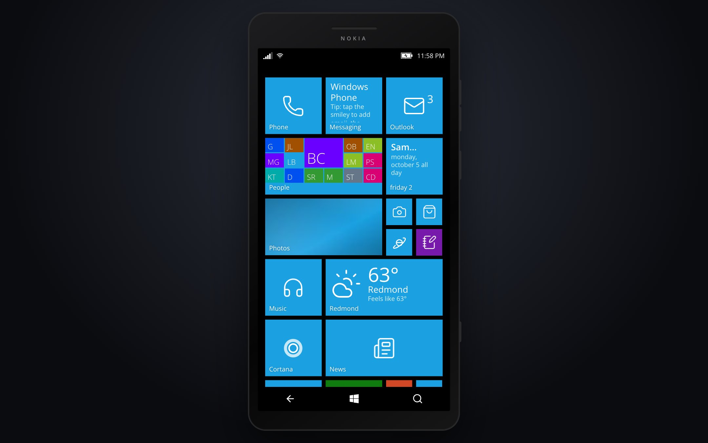
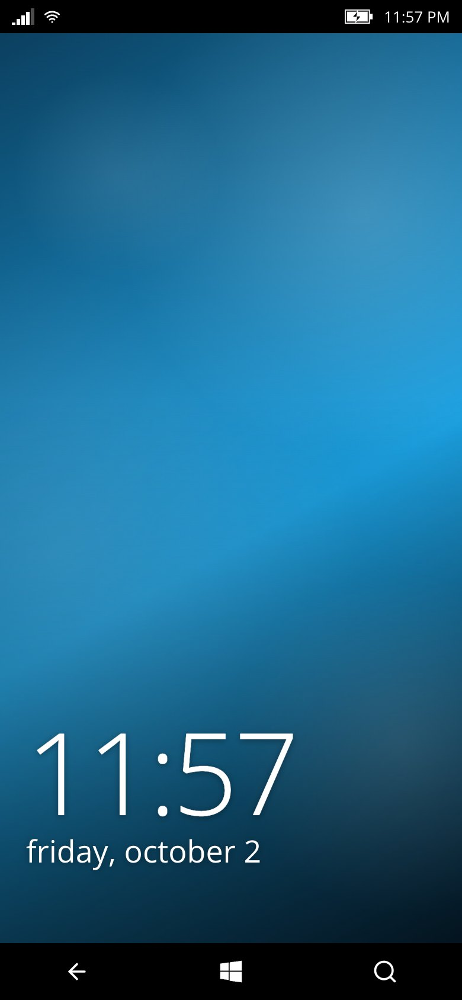
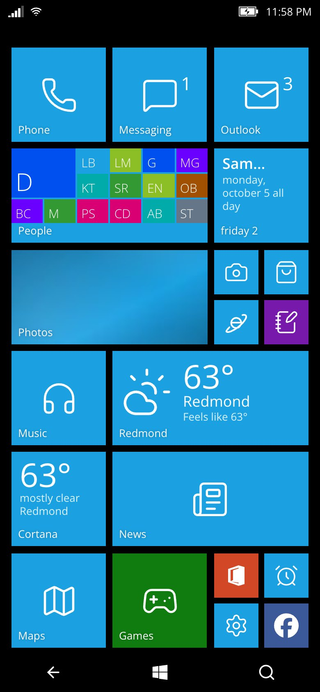
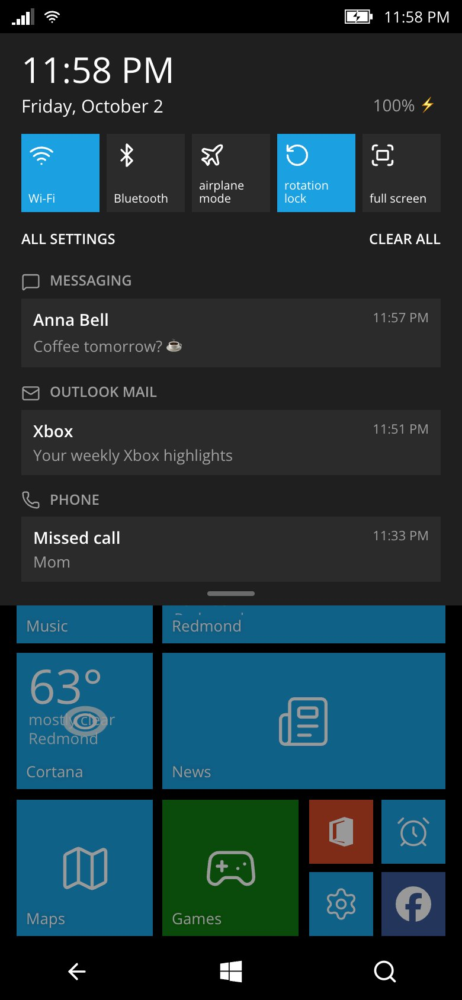
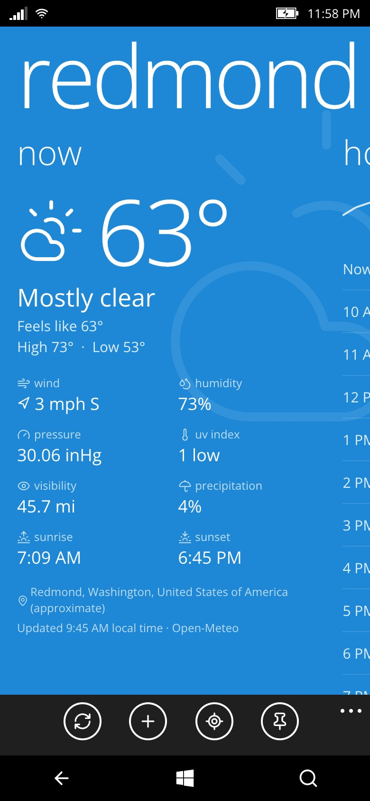
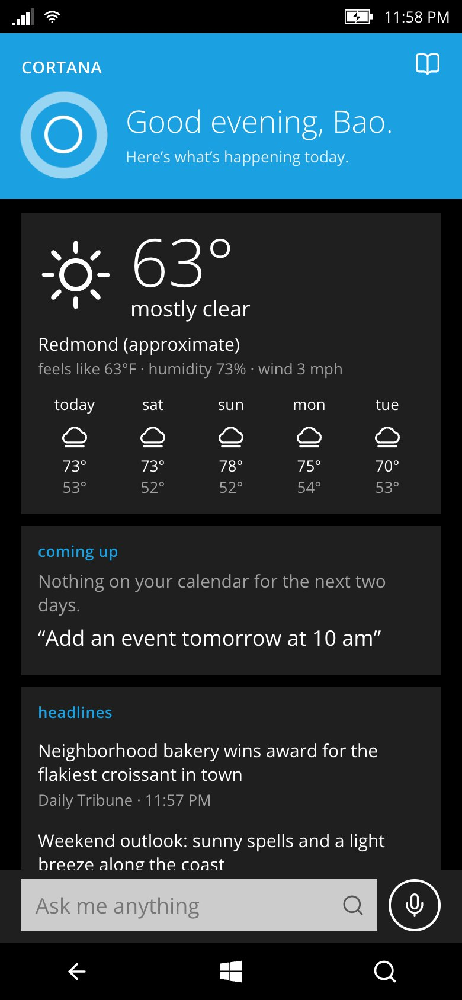
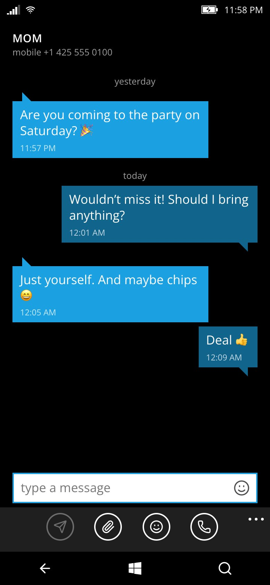
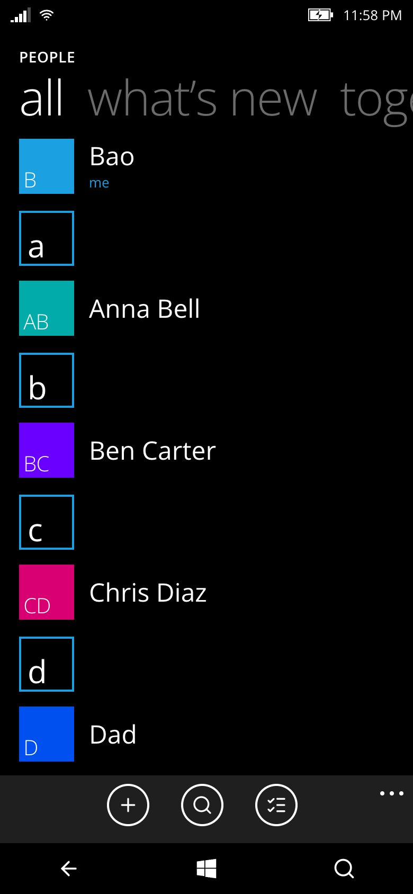
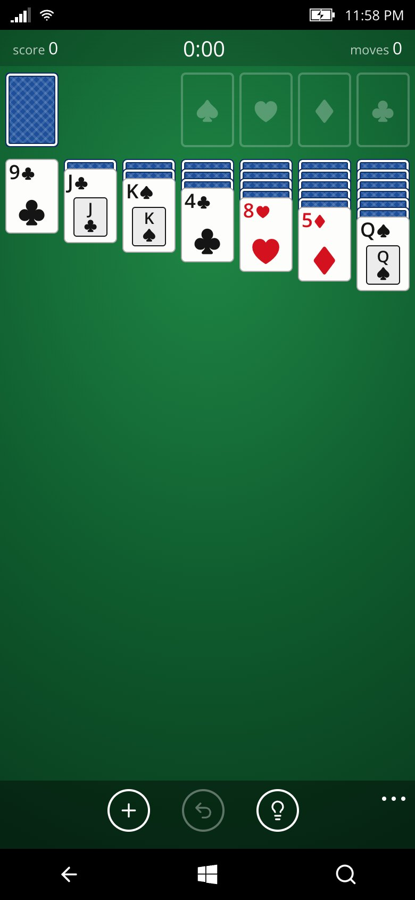
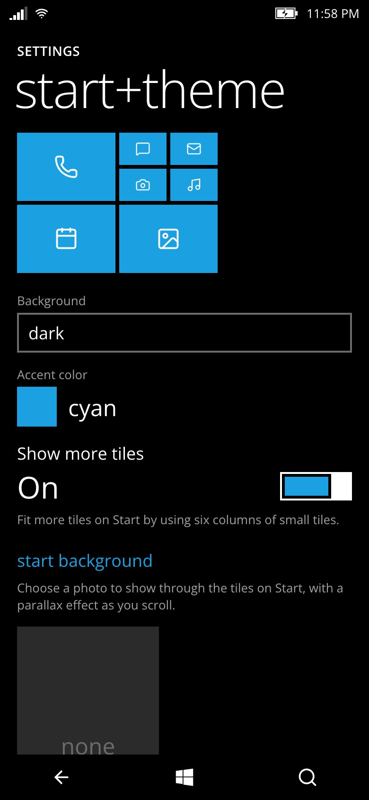

# wphone — Windows Phone 8.1 in the browser

> **Built by Claude.** This project was designed and written end to end by Claude (Anthropic's Claude Opus 5.5, in Claude Code).
> One Claude session planned the architecture, wrote the OS core, the shell, the backend and the app SDK, then ran seven Claude
> sub-agents in parallel to build the 64 apps against that SDK, and finally integrated, tested and fixed everything in a real browser.
> No code in this repository was written by hand.

A Windows Phone 8.1 simulator for the web, made for mobile browsers (on desktop it runs inside a Lumia-style frame).
It is an entertainment project: live tiles, the lock screen with the Bing image of the day, Action Center, the task switcher,
Cortana, Xbox games, and a private on-device file system — nothing a visitor creates ever leaves their browser.

## Screenshots

<p align="center"></p>

<table>
  <tr>
    <td align="center"><br><sub>Lock screen</sub></td>
    <td align="center"><br><sub>Start with live tiles</sub></td>
    <td align="center"><br><sub>Action Center</sub></td>
  </tr>
  <tr>
    <td align="center"><br><sub>Weather</sub></td>
    <td align="center"><br><sub>Cortana</sub></td>
    <td align="center"><br><sub>Messaging</sub></td>
  </tr>
  <tr>
    <td align="center"><br><sub>People</sub></td>
    <td align="center"><br><sub>Solitaire</sub></td>
    <td align="center"><br><sub>Settings</sub></td>
  </tr>
</table>

<sub>On a phone it runs full screen (shots at 390×844); on desktop it sits inside a Lumia-style frame. Contacts, messages and
headlines in these shots are fictional.</sub>

## Highlights

- **The real WP 8.1 feel** — Metro typography, pivots and panoramas, turnstile and tile-flip animations, tilt on press,
  20 accent colors, dark/light themes, tap-and-hold menus, resizable/movable/unpinnable tiles, Start background photo.
- **A working OS in the browser** — app lifecycle with a back stack and task switcher, a virtual file system on IndexedDB,
  live tiles fed by each app, toast notifications + Action Center, background audio that keeps playing after the app closes,
  share sheet, file pickers and "open with".
- **64 apps** (all preinstalled; the Store can uninstall and reinstall them):
  - Phone, Messaging, People, Outlook Mail, Calendar
  - Camera, Photos, Music, Video, FM Radio (real internet radio), Podcasts, Voice Recorder
  - Weather, News, Money, Sports, Maps, Translator, Internet Explorer
  - Office (Word + Excel with formulas), OneNote, Alarms (+ timer, stopwatch), Files, Storage Sense, Battery Saver, Calculator
  - Settings, Store, Cortana (text and voice: alarms, reminders, notes, events, weather, calls, texts, Wikipedia, web search…)
  - Games hub with gamerscore and achievements: Minesweeper, Solitaire, Wordament, Snake, 2048, Blocks
  - Flashlight, Compass, Bing Vision (QR/barcode scanner), Wikipedia, Unit Converter, Mirror
  - 22 social apps of the era (Facebook, Twitter, WhatsApp, Skype, YouTube, Vine…) as branded launchers that deep-link to the
    real app or website, each with a small built-in tool (compose a tweet, message a WhatsApp number, share a link…)
- **Calls and texts stay in the simulator** — calling shows the WP in-call screen with ringback and a simulated answer, and texts
  go to Messaging, on desktop and on phones alike; nothing is handed to the device's real dialer, SMS or mail app.
- **A phone that feels alive** — 16 fictional contacts come with a call history, past text conversations and emails, and they
  text, email and call you now and then (Settings → notifications+actions → "Simulated friends" turns this off).

## Privacy by design

Everything a visitor creates — files, photos, notes, contacts, messages, settings — lives only in their own browser's IndexedDB.
Nothing is uploaded and there are no accounts.

- **No GPS.** The phone never asks for the device's precise location. Weather, Maps, Cortana and friends use, in order: a city the
  user picks in Settings → location, an approximate city from the network (IP lookup on our server), or Redmond, WA.
- **No access to the real address book.** People, Phone, Messaging and Mail are filled with fictional contacts; users can add
  their own or import a `.vcf` file if they want to.
- **No permission prompts on startup.** Camera, microphone, motion sensors and speech are only requested when the user opens an
  app that needs them (Camera, Recorder, Compass, Cortana's mic…).
- The backend proxy serves third-party pages with `Content-Security-Policy: sandbox` (opaque origin) and IE frames them without
  `allow-same-origin`, so web pages can never read the simulator's storage. The proxy refuses private/internal addresses (SSRF guard).

## Run locally

```bash
npm install
npm run server        # backend API on :8787
npm run dev           # Vite dev server on :5173 (proxies /api to :8787)
```

Open http://localhost:5173. Camera and microphone require HTTPS or localhost.

Desktop keyboard: `Esc`/`Backspace` = Back, `Home` = Start, `F2` = task switcher, `F3` = Cortana, `F4` = lock.
Long-press Back = task switcher, long-press Search = talk to Cortana, pull down the status bar = Action Center,
long-press a tile = edit Start. On a phone, "Add to Home Screen" runs it full screen.

## Deploy

The same code deploys two ways: a Node server on a VPS, or a Cloudflare Worker.

### Option A — VPS with Node (≥ 20)

```bash
npm ci
npm run build                   # outputs dist/
PORT=8787 node server/index.js  # serves dist/ + /api
```

Put it behind a reverse proxy with HTTPS (needed for camera, microphone and the offline service worker), e.g. Caddy:

```
wphone.example.com {
  reverse_proxy localhost:8787
}
```

Keep it running with pm2: `pm2 start server/index.js --name wphone` (set `PORT` as needed).

### Option B — Cloudflare Workers (import the Git repo)

1. In the Cloudflare dashboard go to **Workers & Pages → Create → Import a repository** and pick this GitHub repo.
2. Use these build settings:
   - **Build command:** `npm run build`
   - **Deploy command:** `npx wrangler deploy`
3. Deploy. Every push to `main` rebuilds and redeploys automatically.

`wrangler.jsonc` serves the built `dist/` with Workers Static Assets (with single-page-app fallback) and runs the Worker
only for `/api/*`. HTTPS comes for free on `*.workers.dev` or your own domain. The Worker gets the visitor's approximate
city from Cloudflare itself, so no third-party IP lookup is made.

To try the Worker locally: `npm run cf:dev` (http://localhost:8787). To deploy from your machine instead of Git: `npm run cf:deploy`.

## Architecture

Vite + vanilla JavaScript (no framework) on the front end, [Hono](https://hono.dev) for the backend (runs on Node or Cloudflare Workers).

```
server/app.js      shared Hono API (Web APIs only): Bing image of the day, weather (Open-Meteo), geocoding, IP location, news/RSS, FX rates,
                   stock quotes, translation, search/suggest, internet radio, podcasts, readable articles, sandboxed proxy
server/index.js    Node entry (VPS): API + static dist/        server/worker.js   Cloudflare Workers entry (wrangler.jsonc)
src/os/            the "OS": kernel (app lifecycle, back stack), fs (IndexedDB file system), settings, theme, tiles (live tiles),
                   notifications, media (background audio), device (Web API wrappers), net, pickers, sounds, ui (Metro controls)
src/shell/         status bar, nav bar, lock screen, Start + app list, Action Center, task switcher, volume flyout, first run
src/apps/<id>/     apps, auto-discovered (manifest.js, index.js, optional tile.js live tile and background.js service)
docs/APP_SDK.md    how to write an app for the simulator
```

Public data sources used by the backend: Bing, Open-Meteo, BigDataCloud, ipwho.is, BBC RSS, open.er-api.com, Yahoo Finance,
MyMemory, DuckDuckGo, radio-browser.info and the iTunes podcast directory. Maps uses OpenStreetMap, Esri imagery, Nominatim and OSRM.

## Known limitations

- Alarms, reminders and simulated messages only run while the tab is open (browsers throttle background tabs).
- Stock quotes use Yahoo's unofficial endpoint and can be flaky; translation can't auto-detect the source language.

Windows Phone, Lumia, Xbox, Cortana and other names are trademarks of their respective owners. This is a fan-made tribute,
not affiliated with Microsoft or Nokia.
